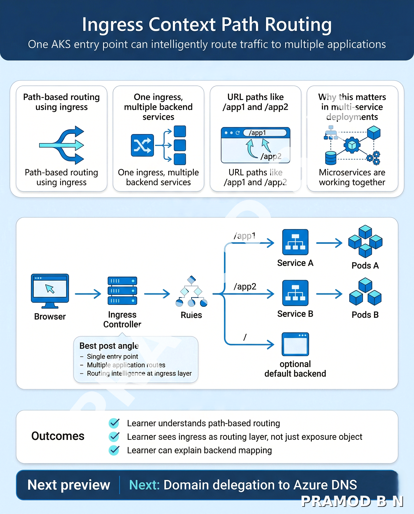

# Folder 10 — Ingress Context Path Routing

## Overview
This module advances the ingress story from simple application entry into practical multi-service routing. It helps the learner understand how one ingress entry point in AKS can route requests to different backend services based on URL paths such as `/app1`, `/app2`, or other context paths.

This is where ingress starts becoming a real traffic-control layer rather than only an external access layer. The learner now begins thinking like a platform engineer who must route multiple workloads cleanly behind a shared front door.

## Why this module matters
In real Kubernetes environments, teams rarely want to expose every application behind a separate public endpoint if a shared ingress entry point can handle multiple routes more efficiently and consistently. Path-based routing is often one of the first scalable patterns used to consolidate external access while keeping backend services independently manageable.

Azure’s ingress documentation explains that ingress can provide name-based virtual hosting and load balancing for services, and Azure’s ingress-controller guidance specifically notes that a single IP address can route traffic to multiple services by using ingress rules. The StackSimplify course sequence also treats context-path routing as the immediate next step after ingress basics, which is the correct progression for advanced traffic control learning.

## What you will learn
- How one ingress entry point can route to multiple backend services by path
- Why path-based routing is a practical multi-service exposure pattern
- How ingress rules and backend services relate to each other under one controller
- Why this pattern is the foundation for more advanced traffic design in AKS

## Workflow position
This module builds directly on Folder 09, where the learner understood a single-service ingress flow. Now the learner evolves that model into multi-service routing behind one shared ingress layer.

This module also prepares the learner directly for:
- Folder 11 — Domain Delegation to Azure DNS
- Folder 13 — Domain Name Based Routing
- Folder 14 — Ingress SSL with Let’s Encrypt

## Included in this folder
- Module overview
- Post image
- Hands-on lab
- Validation guide
- Troubleshooting guide
- Cleanup guide

## Expected outcome
By the end of this module, the learner should be able to:
- explain context-path routing in AKS clearly
- route multiple services behind a single ingress entry point
- understand how path rules are matched and forwarded
- explain why path-based routing is useful before introducing domain-based routing

## Recommended approach
1. Read this overview fully  
2. Review the post image inside `post-assets/`  
3. Complete the lab files in order  
4. Validate the multi-service routing flow carefully  
5. Do not move ahead until path-based routing feels clear as a traffic-engineering pattern, not only an ingress manifest change  

## Next module
The next module is **Domain Delegation to Azure DNS**.

That module expands the traffic story from path-based routing to domain and DNS control, which is where ingress starts connecting to externally meaningful naming and broader production-style exposure patterns.
