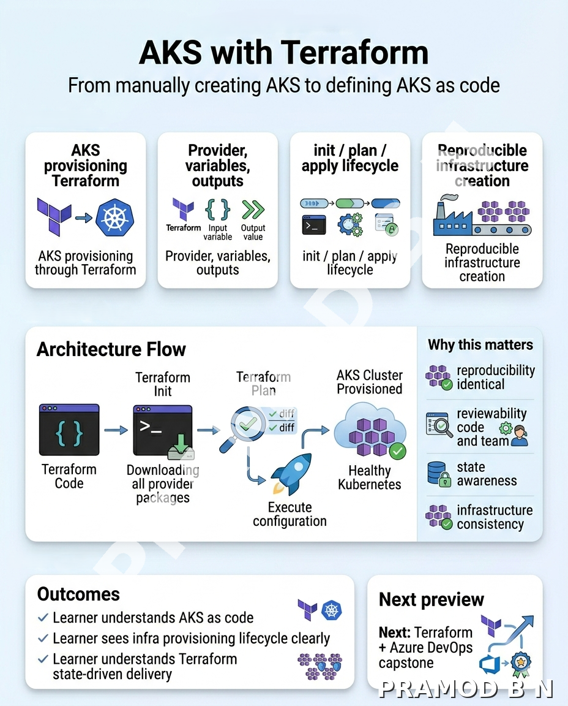

# Folder 24 — AKS with Terraform

## Overview
This module introduces Terraform as the infrastructure-as-code layer for provisioning AKS in a repeatable, version-controlled, and reviewable way. It helps the learner understand how AKS cluster foundations, networking, node pools, and supporting Azure resources can be defined declaratively instead of being created manually.

This is where the course moves from operating AKS to codifying AKS. The learner is no longer only thinking about how to configure a cluster after it exists. The learner is now thinking about how to define the cluster itself as a managed infrastructure product.

## Why this module matters
A mature AKS platform should not rely on click-based provisioning for core cluster foundations. Teams need repeatable environment creation, reviewable changes, and the ability to recreate or evolve infrastructure safely over time.

Terraform is one of the standard IaC tools used for Azure platform provisioning, and the AzureRM provider supports AKS through the `azurerm_kubernetes_cluster` resource. Current provider guidance also notes that AKS is fast-moving and recommends using the latest Azure provider versions when working with AKS.

## What you will learn
- Why Terraform is useful for AKS platform provisioning
- How Terraform structures AKS cluster creation and related Azure resources
- Why state, variables, outputs, and module design matter in AKS IaC
- Why codified infrastructure is a major platform maturity step

## Workflow position
This module follows the full AKS runtime, delivery, governance, and scaling sequence intentionally.

The learner now understands:
- ingress, DNS, TLS
- workload governance and namespaces
- execution models and autoscaling
- image supply, CI/CD, and policy control

Now the final platform step is to codify the cluster foundation itself.

This module also prepares the learner directly for:
- Folder 25 — Terraform + Azure DevOps for AKS
- infrastructure promotion flows
- platform reproducibility and review-driven change management

## Included in this folder
- Module overview
- Post image
- Hands-on lab
- Validation guide
- Troubleshooting guide
- Cleanup guide

## Expected outcome
By the end of this module, the learner should be able to:
- explain why AKS should be provisioned with Terraform in mature environments
- understand the structure of a basic AKS Terraform configuration
- reason about Terraform state and resource dependency for AKS
- explain why this is a natural endgame topic in the course

## Recommended approach
1. Read this overview fully  
2. Review the post image inside `post-assets/`  
3. Complete the lab files in order  
4. Validate the Terraform provisioning flow carefully  
5. Do not move ahead until Terraform feels clear as the cluster-foundation delivery layer, not just another provisioning tool  

## Next module
The next module is **Terraform + Azure DevOps for AKS**.

That module turns Terraform-based AKS provisioning into a pipeline-driven infrastructure-delivery pattern, which is the natural capstone for the course.
